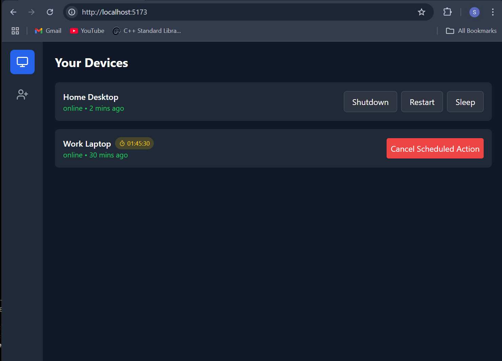

# 🚀 Remote Shutdown App

  
  
  


A remote shutdown and monitoring application that allows users to schedule **shutdown, sleep, and restart commands** for their homelabs. The app supports **both offline and online modes**, with ongoing development for advanced features.

---

## 📋 Features

### 🔌 Offline Tab (Fully Functional)

- **Schedule Shutdown, Sleep, and Restart**:  
  Allows users to schedule actions with a maximum limit of **1 month**.
- **Task Scheduling (Future Update)**:  
  Plan tasks such as shutting down the device after completing downloads or gaming.

### 🌐 Online Tab (Partially Functional)

- **User Authentication**:  
  Login functionality for managing connected devices.
- **Device Management**:  
  Add devices and monitor their uptime status _(In Progress)_.
- **Remote Command Scheduling**:  
  Backend supports **unique code generation**, and the client app connects to the backend. **Currently under development with known errors.**

### 🔒 Security (Planned Enhancements)

- Implement secure communication protocols for all backend and frontend interactions.
- Add resource monitoring features like **CPU usage, RAM utilization, and device temperature stats**.

### 🛡️ Background Mode (In Progress)

- Enable the app to run in the background for continuous monitoring without needing the main window to remain open.

---

## 🎨 Screenshots

### 🖥️ Offline Tab


### 🌐 Online Tab


### 📊 Web App Screenshots

- **Dashboard**  
  

- **Device Management**  
  

- **Command Scheduler**  
  

---

## 🛠️ Installation

### Option 1: Precompiled Binary

Download the executable: **[remote-shutdown.exe](#)**

### Option 2: Build From Source

Follow these steps to clone and build the app locally:

```bash
# Clone the repository
git clone https://github.com/Siarhii/Remote-thing.git

# Navigate into the project folder
cd Remote-thing/client

# Build the app (requires Go and Wails)
wails build

# Run the application
./Remote-shutdown.exe
```

### 💡 Usage

#### Offline Mode

- Use the **Offline Tab** to schedule shutdown, sleep, or restart tasks with a specified timer.

#### Online Mode _(Beta)_

1. Log into your account.
2. Add devices using the unique codes generated by the backend.
3. Manage remote commands. _(Note: This feature is under development and may throw errors.)_

---

### 🚧 Roadmap

- ✅ Working offline tab
- ✅ Polished frontend UI for offline and online tabs.
- ✅ Unique code generator for client apps.
- ⬜ Authentication (remote command scheduling, device monitoring).
- ⬜ Add advanced monitoring stats (CPU, RAM, temperature).
- ⬜ Custom command scheduling (after finishin a download or similar usecases)

---

### 👥 Contributors

- **[Siarhii](https://github.com/Siarhii)** - Developer

---

### 📜 License

This project is licensed under the **MIT License** - see the [LICENSE](LICENSE) file for details.

---

### 🤝 Contributing

Contributions, issues, and feature requests are welcome!  
Feel free to check the [issues page](https://github.com/Siarhii/Remote-thing/issues).

---

### 🌟 Show Your Support

If you like this project, **give it a ⭐️** and share it with others!
